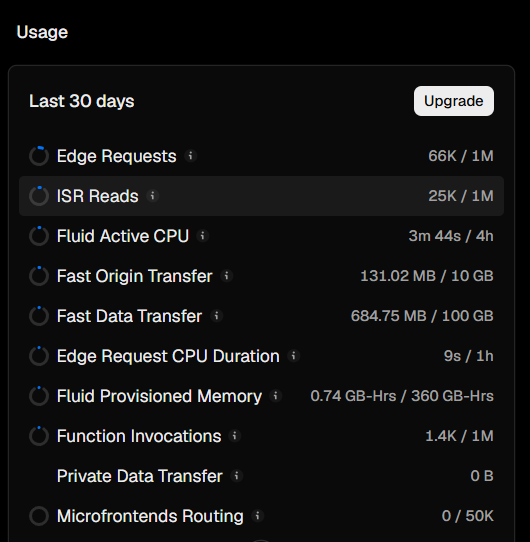

<h1 align="center">Hi, I'm Pranavesh N 👋</h1>
<h3 align="center">Full-Stack Systems Engineer & Product Developer</h3>

  
  

---

### 🚀 About Me
I am a Product-Minded Software Engineer and ECE student at VIT Chennai, specializing in high-efficiency systems architecture, deterministic state engines, and production-ready web deployments. 

- 🔭 **Currently building:** **valarchiX**, a comprehensive financial knowledge operating system and milestone simulation platform.
- ⚙️ **Production Ecosystem:** **Sikkanam**, a privacy-first cost-optimization travel routing engine, and **Marakadhey**, a productivity utility published on the official Chrome Web Store.
- ⚡ **Engineering Focus:** Shifting heavy computational workloads to localized, browser-level rules engines to achieve zero-latency and sub-1% cloud resource footprints.
- 🔬 **Academic Core:** Digital Signal Processing, Kalman Filtering algorithms, and MATLAB mathematical modeling.

---

### 💻 Tech Stack & Arsenal
* **Core:** TypeScript, JavaScript, Python, MATLAB
* **Frontend:** React.js, Tailwind CSS, Progressive Web Apps (PWA)
* **Backend & Cloud:** Node.js, Vercel Serverless Edge, Chrome Extension APIs
* **Databases:** Supabase (PostgreSQL), MongoDB Atlas and Firebase Store

---

### 🏆 Featured Production Deployments
| Project | Description | Live Link |
| :--- | :--- | :--- |
| **[valarchiX Framework]** | Financial simulation suite using data-driven asset analyzers and index-based planning matrices. Built as a fully installable PWA. | [View Platform](https://valarchix.vercel.app) |
| **[Sikkanam Framework]** | Complex travel-intelligence architecture minimizing serverless API compute over OSRM routing loops. | [View Platform](https://sikkanam.vercel.app) |
| **[Marakadhey]** | Asynchronous, event-driven productivity extension managing persistent browser background states. | [Chrome Web Store](https://chromewebstore.google.com/detail/inidbaohifkncdjnondbkljhoogkhnce?utm_source=item-share-cb) | [Edge Addons](https://microsoftedge.microsoft.com/addons/detail/marakadhey%E2%80%93never-miss-opp/cmndbipcnkkmeojkioajenbckapcfpla)
| **[DSP Kalman Filter]** | Speech enhancement pipeline utilizing recursive logic to optimize signal-to-noise ratio in low-frequency ranges. | *Academic Build* |

---

### 📊 Real-Time Production Telemetry (Vercel Edge Logs)

  

- ⚡ **Fluid Active CPU Overhead:**  3 minutes 44 seconds consumed / 4 hours allocated (Highly Optimized execution paths).
- 🌐 **Serverless Request Footprint:** 1400 function invocations / 1,000,000 baseline cap.
- ⏱️ **Edge Request Duration:** 9 seconds total runtime execution across all routing matrices.

---

<i>"Building optimized systems that bridge complex engineering with real-world product deployment."</i>

